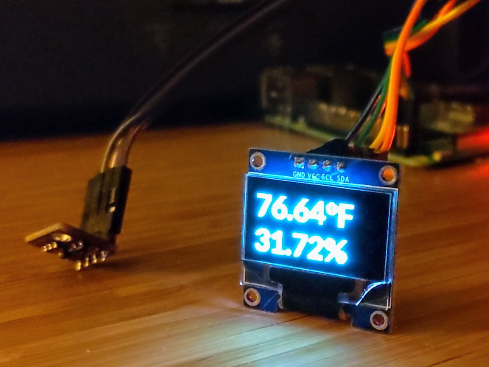

# I2C Bus: BME280 sensor & 0.96" OLED Display

For the folks who want to support super tiny displays, this directory has
info how to show up to two temperatures and humidity from your YANPIWS install like this:


As well, you can show real time temperature if you have both a 
display and a sensor hooked up. This will up date every 100ms. No YANPIWS web server install needed:



Thanks to [raspberrypi-spy](https://www.raspberrypi-spy.co.uk/) for much of this script. 
Thanks to [code electron](http://codelectron.com/how-to-setup-oled-display-with-orange-pi-zero-python-ssd1306/)
 for images and tecno info!


# Requirements

## Hardware 
These python scripts assume you're using I2C compatible hardware.  For my development, I used 
(prices as of Oct 2019):

* $13 - [BME280 Digital 5V Temperature Humidity Sensor](https://amzn.to/2ZL42yZ)
* $5.80 - [Breadboard Jumper Wires](https://amzn.to/2Lesc15)
* $8.99 - [0.96" I2C 128X64 OLED with SSD1306 driver](https://amzn.to/2ImlX9t)

## Software

* Python3
* I2C bus enabled (eg `raspbi-config` or `armbian-config`)
* Adafruit-GPIO Drivers for OLED installed

# Quick start

1. You should already have you screen set up and working.  You should know the I2C bus, 
either `1` or `0`, after running `i2cdetect -l`. As well, you should know the two 
device IDs after running `i2cdetect 0` or `i2cdetect 1`. These are likley `76` for temp & `3c` for display.
1. Edit the  top of your `remote_temps_humid.py` file to update the  `yanpiws_ip`,
`yanpiws_temp_1` , `yanpiws_temp_2` and `bus_number` accordingly. 
The `yanpiws_temp`s are the IDs of the temps in your `config.csv`:

    ```python
    yanpiws_ip = '192.168.68.105'
    yanpiws_temp_1 = '231'
    yanpiws_temp_2 = '63'
    bus_number = 0;
    ```
1. Edit the  top of your `live_temp_hum_bme280.py` file to update the  `temp_sensor_id`,
 and `bus_number` accordingly:

    ```python
    temp_sensor_id = 0x76
    bus_number = 0;
    ```
 1. To see instant live temps of your local sensor, run `python3 live_temp_hum_bme280.py`. To see the
 remote temps from your main YANPIWS install, run  `python3 remote_temps_humid.py`.
 1. To ensure this runs at boot and stays runninig, consider setting up a `systemd` job.  tecadmin.net has [a great write up](https://tecadmin.net/setup-autorun-python-script-using-systemd/) on this!
 
If you need more help - read up on the "Long Start" below.
 
# Long Start
 
These are my notes for doing an install on an Orange Pi Zero. 
 
1. You'll need to wire your devices in parallel. I did it with a harness I made like this
with spliced, soldered and heat-shrink tubed [Breadboard Jumper Wires](https://amzn.to/2Lesc15): 
1. Connect the harness to the correct I2C pins like this (Thanks to [code electron](http://codelectron.com/how-to-setup-oled-display-with-orange-pi-zero-python-ssd1306/)
 for image): 
1. download "bionic" from [armbian](https://www.armbian.com/orange-pi-zero/)
1. write image to microsd card, put in device 
1. plugin in ethernet and boot up device
1. check your DHCP server for "orangepizero" IP
1. login first time with root/1234: `ssh root@192.168.68.104`
1. change root password to something good
1. create your user, use good password 
1. add your ssh key via `ssh-copy-id -i PATH_TO_KEY USER@IP` 
1. edit `/etc/ssh/sshd_conf` to `PasswordAuthentication no`. extra bonus `PermitRootLogin no` 
1. `systemctl restart sshd`
1. apt update;apt dist-upgrade -y
1. run `armbian-config` and do:
   * personal -> timezone -> change time zone to be correct
   * system -> hardware -> check 3 i2c boxes, save
1. reboot
1. ssh back in and run:
`apt install build-essential python3-pip python3-setuptools python3-smbus autoconf libtool pkg-config  python3-pil python3-dev  i2c-tools`
1. run `pip3 install wheel`
1. run `sudo pip3 install --upgrade setuptools`
1. install adafruit drivers 
   1. `git clone https://github.com/adafruit/Adafruit_Blinka.git`
   1. `cd Adafruit_Blinka`
   1. `python3 setup.py install`
   1. `pip3 install Adafruit-GPIO`
   1. `pip3 install Adafruit_SSD1306`
   1. `pip3 install Adafruit_BBIO`
1. go home `cd`
1. make apache dir (even though we don't have apache): `mkdir -p /var/www`
1. check out YANPIWS there `git clone https://github.com/Ths2-9Y-LqJt6/YANPIWS.git /var/www/html`
1. make sure we can see the three I2C buses:
    ```bash
    i2cdetect -l
    i2c-1   i2c             mv64xxx_i2c adapter                     I2C adapter
    i2c-2   i2c             mv64xxx_i2c adapter                     I2C adapter
    i2c-0   i2c             mv64xxx_i2c adapter                     I2C adapter
    ```
1. After wiring up your devices, make sure they show up:
    ```bash
    i2cdetect -y 0
         0  1  2  3  4  5  6  7  8  9  a  b  c  d  e  f
    00:          -- -- -- -- -- -- -- -- -- -- -- -- -- 
    10: -- -- -- -- -- -- -- -- -- -- -- -- -- -- -- -- 
    20: -- -- -- -- -- -- -- -- -- -- -- -- -- -- -- -- 
    30: -- -- -- -- -- -- -- -- -- -- -- -- 3c -- -- -- 
    40: -- -- -- -- -- -- -- -- -- -- -- -- -- -- -- -- 
    50: -- -- -- -- -- -- -- -- -- -- -- -- -- -- -- -- 
    60: -- -- -- -- -- -- -- -- -- -- -- -- -- -- -- -- 
    70: -- -- -- -- -- -- 76 -- 
    ```
1. go to dir `cd /var/www/html/I2C.bme280.oled`
1. edit files per quick start above
1. run files and enjoy!
