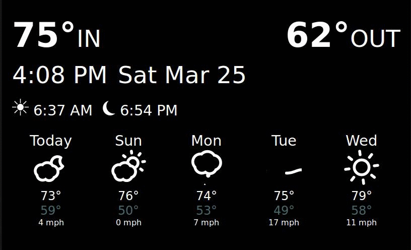
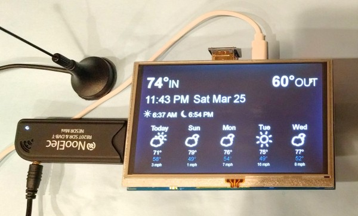

# YANPIWS
Yet Another Pi Weather Station (YANPIWS) - My explorations in getting a Rasberry Pi 
showing local time and weather:



## Overview

For a while I've had a [wireless weather station](http://amzn.to/2nAxo3L).  And for as long as I've 
had it, it's never quite worked right.  Certainly the part about 
"Equipped with an atomic clock, time is set automatically via radio" has *never* worked.  As 
well, maybe the sunset/sunrise times were accurate once or twice.  The only thing 
that worked pretty well was the indoor and outdoor temperatures.  I stumbled upon the
[rtl_433](https://github.com/merbanan/rtl_433) project and I was super stoked
to DIY a weather station.  

Goals for this project are:

* Use cheap hardware (e.g. Rasberry Pi from 2017)
* Show live weather from local, wireless sensors
* Show time
* Show today's sunset/sunrise times
* Show weather forecast from a forecast API ([Dark Sky](https://darksky.net/dev/) or  [Pirate Weather](pirateweather.net/))

## Hardware

Here's the parts I used and prices at time of publishing (March 2017):

* $20 - [433 MHz SDR USB dongle](http://amzn.to/2nc5MhX)
* $13 - [Wireless Temperature sensor](http://amzn.to/2lVdhJ6)
* $40 - [5" 800x480 screen](http://amzn.to/2mRjWYT)
* $43 - [Rasberry Pi 3 Model B and Power Adapter](http://amzn.to/2nklto3)
* $11 - [8GB Micro SD card](http://amzn.to/2nRE9Pt)

Total for this is $127, so, erm, not _that_ cheap.  Ideally you'd have a lot of 
parts around you could re-use for this project. As well, you could reduce the price by going with a 
3.5" screen ([only $17](http://amzn.to/2mCIxlg)) and Pi B+ ([only $30](http://amzn.to/2n5nioJ))
. For the B+ you'd have to use ethernet or bring your own USB WiFi 
adapter.  I knew I'd have use for a 5" HDMI monitor, so I was happy to pay the premium.

Caveat Emptor - You'd probably be better off spending even more (ok, not so cheap here any more ;)
on a less janky wireless setup like [z-wave](http://amzn.to/2n3RFLn). I found out the hard way that
the IDs of the $13 sensors change every time the sensor batteries die/are changed. ~~As well, the Pi WiFi 
seems to interfere with the USB SDR (I'm inspiring confidence, yeah?!)~~ Turns out I just needed to move
the antenna further away from the Pi! Finally, I coded the HTML
and CSS to work in an 800x480 screen or greater. If you use the cheaper, 
lower resolution screen (480x320), YANPIWS just works thanks to ``@media`` sensing.  
As well, it works on mobile devices and desktop devices as well.  All be it, mobile 
works best in landscape.

If you want to use the BME/BMP 280 I2C chip instead, this is now supported! So instead of 
getting the SDR USB dongle and Wireless Temperature Sensora above, instead get 
(prices as of Sep 2019):

* $13 - [BME280 Digital 5V Temperature Humidity Sensor](https://amzn.to/2ZL42yZ)
* $5.80 - [Breadboard Jumper Wires](https://amzn.to/2Lesc15)

While this reduces costs, it also changes how the set up works.  You'll only be able to run one 
sensor on the I2C bus and you'll have to know how to solder.  Finally, check out the alternate
install steps below.

## Install steps

These steps assume you already have 
[downloaded Buster with Desktop](https://www.raspberrypi.org/downloads/raspbian/) 
to your Pi and it's
[installed and booting](https://www.raspberrypi.org/documentation/installation/installing-images/README.md),
 [online](https://www.raspberrypi.org/documentation/configuration/wireless/README.md) 
 and [accessible via SSH](https://www.raspberrypi.org/documentation/remote-access/ssh/README.md). Further
 be sure your [timezone is correct](https://www.raspberrypi.org/documentation/configuration/raspi-config.md)!
 I recommend using a normal monitor for the install instead of the 5". It's easier this way. 
 
Speaking of monitors - this install also assumes you have your 5" display (or 3.5" if you 
went that way (or what ever display you want!)) already working. 
 
These steps also assume you're using the SDR dongle and wireless temp sensors.  See below for
BME280 sensors.
 
All steps are done as the *Pi User* - be sure you've changed this user's password
from "raspberry" ;)

1. Ensure your Pi is current;
    ```
    sudo apt update&& sudo apt dist-upgrade
    ```
1. Install rtl, git, apache, php, chrome and chrome utils for doing 
full screen (some of which may be installed already):

   ```
   sudo apt-get install -y curl git chromium-browser apache2 php php-curl php-xml unclutter sed rtl-433
   ```
   **RTL Note:** If your distro doesn't have the `rtl_433` package available via `apt`, follow these compile/download steps: Download, compile and install [rtl_433](https://github.com/merbanan/rtl_433) or use the faster method cited on [tech.borpin.co.uk](https://tech.borpin.co.uk/2019/12/17/install-a-package-from-the-testing-repository/) which involves adding a testing apt repo.  Note that the last apt call should be `apt install rtl-433` with a dash not an underscore.  Also on that page note that `/etc/apt/preferences` should be `/etc/apt/preferences.d/`.
   
   **PHP Note:** You need to ensure you install PHP 8.3 or later 
1. With your wireless temp sensor(s) powered up and the USB Dongle attached, make sure your 
sensors are read with `rtl_433`. Let it run for a while an note the IDs returned for the later step
of creating your own config file.  Here we see ID 231:
    ```
    pi@raspberrypi:~ $ rtl_433
    rtl_433 version unknown inputs file rtl_tcp RTL-SDR SoapySDR
    [SNIP]
    Sample rate set to 250000 S/s.
    Tuner gain set to Auto.
    Tuned to 433.920MHz.
    Allocating 15 zero-copy buffers
    _ _ _ _ _ _ _ _ _ _ _ _ _ _ _ _ _ _ _ _ _ _ _ _ _ _ _ _ _ _ _ _ _ _ _ _ _ _ _ _ _ _ _ _ _ _ _ _ _ _ _ _ _ _ _ _ _ _ _ _ _ _ _ _ _ _ _ _ _ _ _ _ _ _ _ _ _ _ _ _ _ _ _ _ _ _ 
    time      : 2020-05-11 00:55:17
    model     : Fineoffset-WH2                         ID        : 231
    Temperature: 35.5 C      Humidity  : 1 %           Integrity : CRC
    _
    ```
   If you get an error `usb_open error -3` or `usb_claim_interface error -6`, unplug and 
   replug the USB dongle, that should fix it.
1. Clone this repo, symlink `html` into `www` and create your own `config.csv`:
   ```
   cd
   git clone https://github.com/Ths2-9Y-LqJt6/YANPIWS.git 
   cd YANPIWS
   cp config.dist.csv config.csv
   sudo rm -rf /var/www/html
   sudo ln -s /home/pi/YANPIWS/html /var/www/html
   sudo chown -R pi:www-data data
   sudo chmod -R 775 data
   ``` 
1. Edit your newly created `config.csv` to have the correct values. 
Specifically, your latitude (`lat`),
longitude (`lon`) and labels which you 
got in the step above running `rtl_433`. As well, you'll need to sign up for an API key
on [Dark Sky](https://darksky.net/dev/register) or [Pirate Weather](pirateweather.net/) and put that in for the `forecast_api` value below. 
If you want static icons instead of
animated ones, set 'animate' to `false` instead of `true` like below. Here's a sample:
    ```
    # edit these two to be your location.  Use one of these if
    # you need help! https://duckduckgo.com/?q=what's+my+lat+long+finder
    lat,31.775554
    lon,-81.822436
    
    # check https://www.php.net/manual/en/timezones.php for available timezones
    timezone,America/Los_Angeles
    
    # set your forecast API token from either Dark Sky or Pirate Weather
    forecast_api_token,aabbccddeeffgghhiijj112233445566
    
    # set your provider for forecasts (must end in an:
    #   pirate weather: https://api.pirateweather.net
    #   dark sky: https://api.darksky.net
    forecast_api_url,https://api.pirateweather.net
    
    # should we show animated icons for forecast? should be "true" or "false"
    animate,true
    
    # label ID map to human name. Format is "labels_" + ID + "," + NAME
    labels_211,In
    labels_109,Out
    
    # How many temperatures to show on the screen (tested with 1, 2 or 3 - watch out if you do more!)
    temp_count,2
    
    # CSS font sizes
    font_time_date_wind,35
    font_temp,50
    font_temp_label,25
    
    # set dark or light theme. if unset or unrecognized, defaults to dark
    theme,dark
    
    # likely this won't need to change if you're following default install instructions.
    dataPath,/home/pi/YANPIWS/data/
    
    # there's only one of these, so likely this won't change
    moondata_api_URL,https://aa.usno.navy.mil/api/rstt/oneday
    
    # unless you're deploying a lot of nodes reporting back to a central server, don't touch these ;)
    # api_password very likely should match servers_0_password unless, again, you know what you're doing ;)
    api_password,boxcar-spinning-problem-rockslide-scored
    servers_0_url,http://127.0.0.1
    servers_0_password,boxcar-spinning-problem-rockslide-scored
    ```
1. Run these commands to copy the `kiosk.sh` script into systemd and enable the service. This 
will  to auto start Chromium in kiosk mode on the Pi's web server every time you boot:

   ```
   cd ~pi/YANPIWS
   sudo cp scripts/kiosk.service /lib/systemd/system/kiosk.service
   sudo systemctl daemon-reload
   sudo systemctl start kiosk.service
   sudo systemctl enable kiosk.service
   ```
   Thanks to [Py My Life Up](https://pimylifeup.com/raspberry-pi-kiosk/) pages for the howto
1. Reboot your Pi so confirm the browser starts loading the configured YANPIWS app.
1. [Add a cronjob](https://www.raspberrypi.org/documentation/linux/usage/cron.md) 
for the Pi user to run every 5 minutes to ensure temperature collection is happening:
    ```
    */5 * * * * /home/pi/YANPIWS/scripts/start.sh >> /home/pi/YANPIWS/data/cron.log

    ```
    This step will need some improvement as the ``rtl_433`` process can die and your temps will stop
    being updated :( Stay tuned!

Whew that's it!  Enjoy your new weather station. Let me know which awesome case you
 build for it and report any bugs here!
 
 


### Alternate install steps for attached I2C sensor

Follow the exact same steps as above, but don't do the last step with the cron job.  Instead,
you'll need to:

1. Make sure I2C is enabled by running `sudo raspi-config` -> "Interfacing Options" -> I2C -> "Yes" -> Reboot
1. Ensure that your BME280 sensor is attached correctly. 
 [Raspberry Pi Spy](https://www.raspberrypi-spy.co.uk/2016/07/using-bme280-i2c-temperature-pressure-sensor-in-python/) 
provided [this great schematic](./images/BME280-Module-Setup.png).
1. Assuming you installed in `/home/pi/YANPIWS/`, run `python /home/pi/YANPIWS/scripts/bme280.py` and 
ensure you see good data.  This looks like this for me:
    ```bash
    {"time" : "2019-09-05 14:05:00", "model" : "BMP280", "id" : 96, "temperature_F" : 80.456, "humidity" : 40.54}
    ```
1. If that all looks good, as the `pi` user, set up a cron job to run once a minute and generate the stats:
    ```bash
    */1 * * * * cd /home/pi/YANPIWS/html/php;/usr/bin/python /home/pi/YANPIWS/scripts/bme280.py | /usr/bin/php -f read_and_post.php
    ``` 
   
### Multiple Sensor Nodes

If you have a lot of places you want to run temperature sensors, as of version 0.9.2, YANPIWS now
supports a server/client deployment. This means you have the ability to run an install that does 
nothing but send it's data to another YANPIWS instance.
To set that up, go ahead and deploy the 2nd (Nth!!) instance based on the steps above.  Make sure everything
is working.  Then, follow these steps:

1. Get the IP address of where you want to send the data to.  See `ifconfig` if you need help (this
command may work, but is likely fragile, `ifconfig|grep -i inet|grep broadc|cut -d ' ' -f10`). We'll
pretend you got the ip `192.168.4.199` back. But use the real IP!
1. One the remote node, edit the `config.csv` file and in the bottom section after the `$YANPIWS['servers'][]`
line, do one of the following:
   * change the URL line `url` to be: `'url' => 'http://192.168.4.199',`. Remember, this should be the IP you 
   got in the 
   prior step. This will cause the data to not be stored locally on the node at all.  It will only
   be sent to the remote server. The final result should look like this:
   
       ```php
        $YANPIWS['servers'][] = array(
           'url' => 'http://192.168.4.199',  // no trailing slash please ;)
           'password' => 'boxcar-spinning-problem-rockslide-scored', // should match password above
        );
     
   OR
   * add 4 new lines with your new IP. The final result  will look like this:
   
       ```php
        $YANPIWS['servers'][] = array(
            'url' => 'http://127.0.0.1',  // no trailing slash please ;)
            'password' => 'boxcar-spinning-problem-rockslide-scored', // should match password above
        );
        $YANPIWS['servers'][] = array(
           'url' => 'http://192.168.4.199',  // no trailing slash please ;)
           'password' => 'boxcar-spinning-problem-rockslide-scored', // should match password above
        );
        ``` 
     
     This will cause the client to write to BOTH the local and remote YANPIWS instances
1. If your using the BME280 chip on both your server and your client(s), you'll need to edit the `bme280.py`.
This is because all of the BME280 chips have the same ID and your server won't know which sensor is which.
To fix this, change line 165 from this:

    ```python
    json = '{"time" : "' + str(rightnow) + '", "model" : "BMP280", "id" : ' + str(chip_id) + ', "temperature_F" 
    ```   
        
     To this:

    ```python
    json = '{"time" : "' + str(rightnow) + '", "model" : "BMP280", "id" : "44", "temperature_F" 
    ```  
        
     What this does is hard code this sensor to ID `44`.  For each new node you deploy, you'll need to change this 
     to it's own unique value.
1. On your server update the `$YANPIWS['labels']` to have an entry for your new sensor.  In the case of our
`44` example above, along with default `96` that the BME280 uses, that would look like this:

    ```php
    $YANPIWS['labels'] = array(
        '96' => 'In',
        '44' => 'Out',
    );
    ```

### API calls

YANPIWS, as of version 0.9.2, now has an HTTP API that you can use to send data.  This means
that anything that can do a `POST` to the IP of your YANPIWS server instance, can send it temp data!
The following fields are required:
* `id` - (int) the ID you want to write to the DB
* `time` - (string) the time of of the data, must be in Y-M-D H:M:S format like `2019-09-18 23:59:02`
* `temperature_F` - (float) of the temperature in ferinheight 
* `password` - (string) must match what you have in your `config.csv` file under `api_password`. 
The default value is `boxcar-spinning-problem-rockslide-scored`.

Optionally you may pass:
* `humidity` - (float) of the humidity

You should use the following URL for your `POST`, replace `IP_ADDRESS` with your real 
IP address of your server:

* `http://IP_ADDRESS/parse_and_save.php`

## Development

Check out this repo, `cd` into the `html` directory and start a web server:

```
php -S  localhost:8000
```

The rtl_433 works great on Ubuntu for desktop/laptop development.  Manually kick off the input 
script and leave it running while you code to gather live temps:

```
cd html/php
rtl_433 -f 433820000 -C customary -F json -q | php -f read_and_post.php
```

If you don't want to deal with running the rtl-433 script, copy the sample data 
``example.data`` to today's date (YEAR-MONTH-DAY) into the ``data`` directory.  It has IDs 211 
and 109 which are the ones already in config.dist.csv.

As well, if you want to simulate individual inputs via the HTTP POSTs, you can use this `curl` command.
Note that we're using the default password, you may need to change this if you've changed it in your 
deployment:

```bash
curl --data "password=boxcar-spinning-problem-rockslide-scored&temperature_F=44.08&id=2&time=2019-09-18 23:59:02" http://localhost:8000/php/parse_and_save.php
```

As the `bme280.py` script outputs JSON, if you want to more closely similate the cron job that's run, incluidng using
the config vars and a real `POST`, you can use this:

```bash
cd html/php
echo '{"temperature_F":"44.08","id":"2","time":"2019-09-18 23:59:02"}' | php read_and_post.php
```

Conversely, if you want to use the now deprecated `STDIN` method, you can use `echo` to pipe in JSON: 

```bash
cd html/php
echo '{"temperature_F":"44.08","id":"2","time":"2019-09-18 23:59:02"}' | php parse_and_save.php
```

Use your IDE of choice to edit and point your browser at ``localhost:8000`` 
(or the IP of your Pi) and away you go.

PRs and Issues welcome!

## Version History
* 0.12.0 - Nov 15, 2024
  * adds phases of moon and set and rise times for same per #114
  * also fixed a bunch of error handling that was failing, also in #114
  * requires PHP >8.3!
* 0.11.2 - Dec 29,2023
  * fixes temps not updating per #112
* 0.11.1 - Dec 28,2023
  * fixes 404s per #108
* 0.11.0 - Dec 28,2023
  * Adds a static page feature per #106
  * Does some general cleanup like fixing variable name typos, var -> let etc
  * allows user to pick between light or dark mode in config
  * refactors directories in HTML to be hierarchical
  * adds favicons
* 0.10.3 - Nov 4,2023
    * Fix dupe day per #104
* 0.10.2 - Sep 3,2023
  * Fix API string length per #102
* 0.10.1 - Sep 3,2023
  * Fix pirate weather overage per #100
* 0.10.0 - Apr 3,2023
  * Support Pirate Weather by default #69
  * Move to SemVer versioning (MAJOR.MINOR.PATCH)
* 0.9.10 - Jul 20,2020
  * Convert to more JSON, less HTML over AJAX calls #89
  * Allow big clock mode by clicking time #82
* 0.9.9 - Jul 20,2020
  * Add user configurable font sizes #80
  * Better temp layouts #83
* 0.9.8 - May 11,2020
  * Organize files into directories, update readme accordingly #73
* 0.9.7 - May 10, 2020 
  * Updated readme, kiosk steps, rtl_433 install steps #70
* 0.9.6 - Nov 20, 2019
  * Add config for 1, 2 or 3 temps on screen #64
  * Update health check logic #61
* 0.9.5 - Nov 12, 2019
  * Improve all python scripts to take arguments instead of being edited #54
  * Fix empty bad time format from #51 per #56
  * add info on how to use systemd to update mini display with python scripts #58
  * add info on how to use systemd to update mini display with python scripts #59
  * put last updated file for every AJAX call #61
* 0.9.4 - Oct 10, 2019 - tidy up python scripts per #50 and #51
* 0.9.3 - Oct 1, 2019 - merge old PR #20 with:
  * add stats dashboard per #17
  * adds AJAX reloads per #19
  * add windspeed per #16
  * remove GMT from config per #23
  * offer animated or static icons per #25
  * Fix labels per #24
  * natively support both 5" and 3.5" screens per #13
  * all functions documented and commented per #32
  * make title text yellow if caches are older than 10 minutes per #37
  * don't cache invalid dark sky data #36
* 0.9.2 - Sep 19, 2019 - add support for, and default, to http POST for 
data gathering. Fix typo & fix minor bug with use of `rand()`. Update docs for same. 
* 0.9.1 - Sep 9, 2019 - implement support for BME280 I2C sensors
* 0.9 - Mar 26, 2017 - get feedback from [@jamcole](https://github.com/jamcole) (thanks!), 
add developer section, add getConfigOrDie(), 
simplify index.php, add better logging for debugging
* 0.8 - Mar 26, 2017 - Use cron to ensure temperature collection happens, omg - pgrep where have you been
all my life?!
* 0.7 - Mar 25, 2017 - Add Install Steps, tweak sun icon, full path in config, 
better handle empty config file
* 0.6 - Mar 25, 2017 - horizontal layout, moon and sun icons instead of text, bigger forecast icons
* 0.5 - Mar 24, 2017 - simplified layout, improve readme, better error handling of missing config.php
* 0.4 - Mar 24, 2017 - cache darksky API calls, implement layout for 800x480 screen
* 0.3 - Mar 23, 2017 - forecast if you have a darksky API
* 0.2 - Mar 23, 2017 - reading CSV, super basic HTML output
* 0.1 - Mar 22, 2017 - parsing data, writing to CSV, crude readme, no html output
