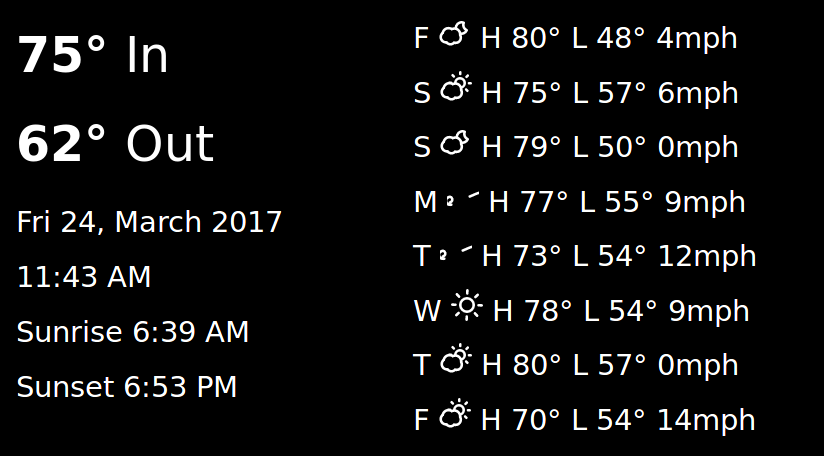

# YANPIWS
Yet Another Pi Weather Station (YANPIWS) - My explorations in getting a Rasberry Pi 
showing local time and weather:



## Background

With a daily workflow that involves checking out a repo, making
commits, and the stopping work, it only made sense that I'd
do the same for my efforts to write a little weather app for my
Pi. This habit means my work is always backed up and ready
for others to review or for me to load up on the another computer.

Goals for this project are:

* Show live weather from local, wireless sensors
* Show time
* Show today's sunset/sunrise times
* Show weather forecast from Dark Sky API https://darksky.net/dev/

## Hardware

* [433 MHz SDR USB dongle](http://amzn.to/2nc5MhX)
* [Wireless Temperature sensor](http://amzn.to/2lVdhJ6)
* [5" 800x480 screen](http://amzn.to/2mRjWYT)
* [pi and power](http://amzn.to/2nklto3)

## Software

We'll be using [rtl_433](https://github.com/merbanan/rtl_433) 
to talk to the USB SDR dongle which will read the temperatures from the sensors
with a a call like this:

```
rtl_433 -C customary -F json -q | php -f parse_and_save.php
```

And then, since I'm a PHP guy, we'll have that ``parse_and_save.php``, 
be, you know php, that parses it, but my proof of concept looks
like this (thanks [stackoverflow](http://stackoverflow.com/a/11968298)!):

```php
#!/usr/bin/php
<?php

while($f = fgets(STDIN)){
    parseJson($f);
}

function parseJson($jsonLine){
    print_r(json_decode($jsonLine));
} 
```

And while I thought it'd be hot to use influx db and grafana 
like all the cools kids 
(see [giatro.me](http://giatro.me/2015/09/30/install-influxdb-and-grafana-on-raspberry-pi.html)) 
that's really hard.  I'll KISS and either
use an existing LAMP set up or do LAMP on the pi like so:

```
sudo apt-get install apache2 php5 php5-mysql mysql-server
```

And then show the data in basic text.  Later, possibly via something like 
[canvasjs](http://canvasjs.com/html5-javascript-dynamic-chart/).

Finally, use chrome to show it full screen:

* autoboot chrome full screen https://blog.gordonturner.com/2016/12/29/raspberry-pi-full-screen-browser-raspbian-november-2016/
* add --incognito to remove errors https://superuser.com/questions/461035/disable-google-chrome-session-restore-functionality#618972

## data

Currently we're writing it in a 4 column CSV to the ``data`` folder:

```csv
DATE,ID,TEMP,HUMIDITY
2017-03-22 23:26:22,109,57.92,25
2017-03-22 23:26:55,211,72.5,34
```

## Version History
* 0.6 - Mar 25, 2017 - horizontal layout, moon and sun icons instead of text, bigger forecast icons
* 0.5 - Mar 24, 2017 - simplified layout, improve readme, better error handling of missing config.php
* 0.4 - Mar 24, 2017 - cache darksky API calls, implement layout for 800x480 screen
* 0.3 - Mar 23, 2017 - forecast if you have a darksky API
* 0.2 - Mar 23, 2017 - reading CSV, super basic HTML output
* 0.1 - Mar 22, 2017 - parsing data, writing to CSV, crude readme, no html output